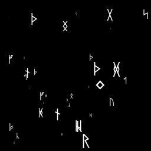

Texture generator with randomly placed characters.
====

Overview

Make the Emissive Scroll Mask for Airis
In settings.py, you can set the image size and background color, the characters you want to randomly place and their font, size, and color.



## Description
Generates a Mask texture for Airis' Emissive Scroll, an avatar for VRChat.

## Requirement
- Python 3
- pillow
- Any Font

## Usage
1. Configure setting files.(settings.py)
1. `python main.py`

## Install
```bash
pip install pillow
```

## Licence

[MIT](https://github.com/tcnksm/tool/blob/master/LICENCE)

## Author

[JO3QMA](https://github.com/jo3qma)